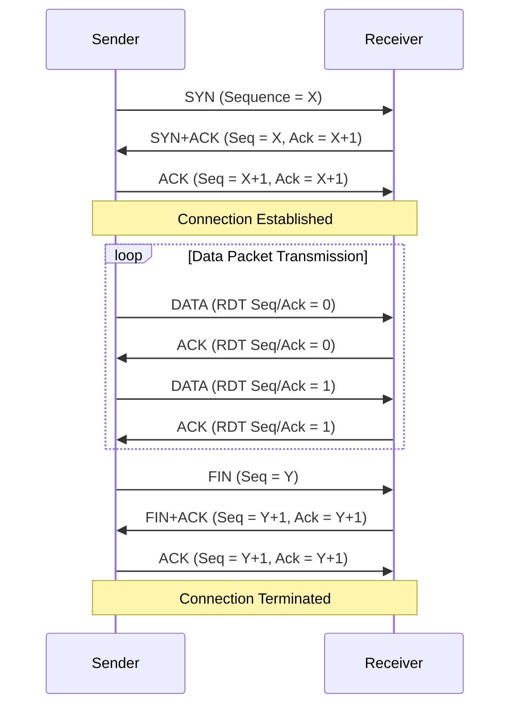
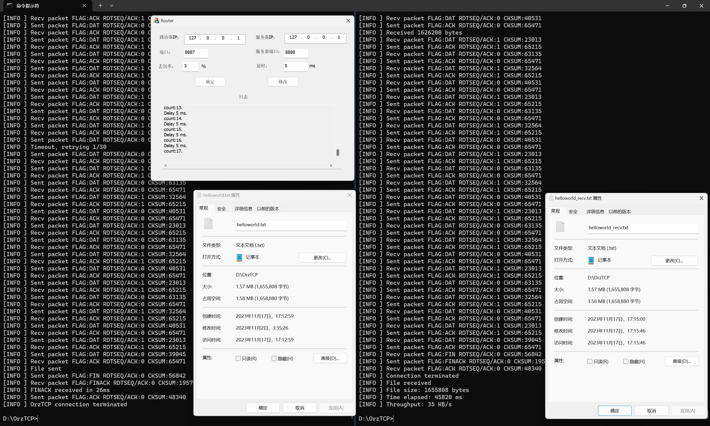
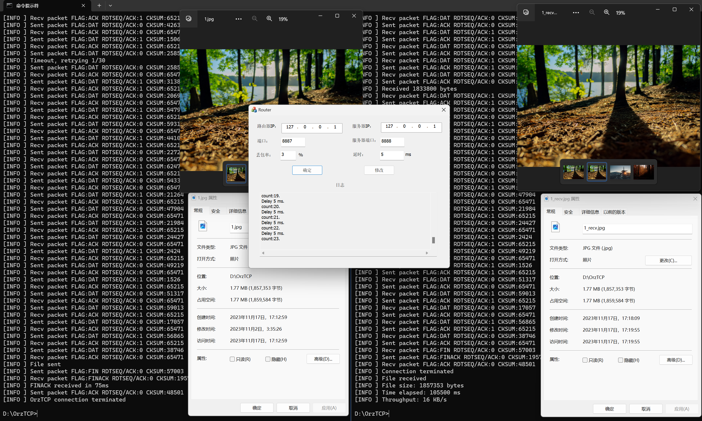
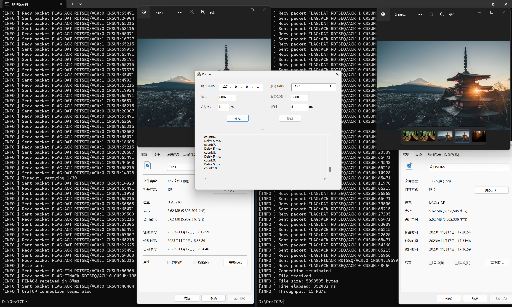
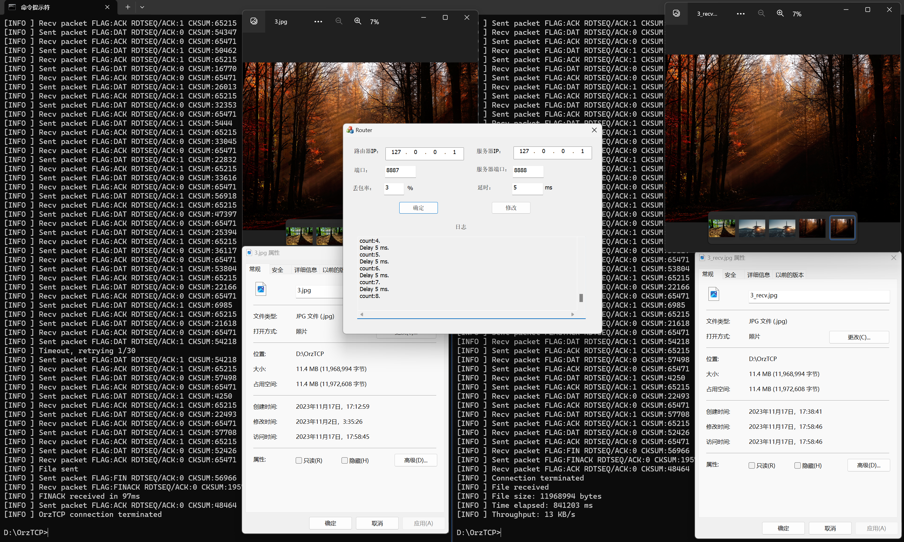

# 计算机网络实验报告
## 实验3：基于UDP服务设计可靠传输协议并编程实现（3-1）
> 物联网安全 2112052 郭大玮

## 协议设计

鉴于三次实验的兼容性考虑，因此直接设计了包含三次实验所需字段的协议，具体如下：

### 报文头：
```
// OrzTCP Header
//  0                   1                   2                   3  
//  0 1 2 3 4 5 6 7 8 9 0 1 2 3 4 5 6 7 8 9 0 1 2 3 4 5 6 7 8 9 0 1 
// +-+-+-+-+-+-+-+-+-+-+-+-+-+-+-+-+-+-+-+-+-+-+-+-+-+-+-+-+-+-+-+-+
// |    Type (8)   |RDT Seq/Ack (8)|         Reserved (16)         |
// +-+-+-+-+-+-+-+-+-+-+-+-+-+-+-+-+-+-+-+-+-+-+-+-+-+-+-+-+-+-+-+-+
// |                     Sequence Number (32)                      |
// +-+-+-+-+-+-+-+-+-+-+-+-+-+-+-+-+-+-+-+-+-+-+-+-+-+-+-+-+-+-+-+-+
// |                  Acknowledgment Number (32)                   |
// +-+-+-+-+-+-+-+-+-+-+-+-+-+-+-+-+-+-+-+-+-+-+-+-+-+-+-+-+-+-+-+-+
// |            Length (16)        |           Checksum (16)       |
// +-+-+-+-+-+-+-+-+-+-+-+-+-+-+-+-+-+-+-+-+-+-+-+-+-+-+-+-+-+-+-+-+
// |                            Payload ...                        |
// +-+-+-+-+-+-+-+-+-+-+-+-+-+-+-+-+-+-+-+-+-+-+-+-+-+-+-+-+-+-+-+-+
```

Type: 报文类型，8 位，采用类似 TCP 的标志位方式，均为 1 置位，具体定义如下：
```
  0   1   2   3   4   5   6   7
+---+---+---+---+---+---+---+---+
|SYN|ACK|FIN|     Reserved      |
+---+---+---+---+---+---+---+---+
SYN: 同步位，用于三次握手。
ACK: 确认位，用于三次握手和四次挥手。
FIN: 结束位，用于四次挥手。
全部位置 0 表示数据报文 (DATA)。
```


RDT Seq/Ack: 8 位，用于 RDT 3.0 协议的序列号和确认号，仅用于本次实验（停等协议），该字段只有 0 和 1 两个值，用于区分两个序列号。下次实验会删掉该字段。

Reserved: 2 字节，保留字段，暂时未使用。

Sequence Number: 32 位，序列号，本次实验仅用于 TCP 三次握手和四次挥手，下次实验会用于数据报文的序列号。

Acknowledgment Number: 32 位，确认号，本次实验仅用于 TCP 三次握手和四次挥手，下次实验会用于数据报文的确认号。

Length: 16 位，报文长字节数，**不包括报文头。**

Checksum: 16 位，校验和，用于校验报文头和报文体的完整性，校验算法与 TCP 相同。

Payload: 报文体，变长，用于传输文件数据。

### 建立连接：三次握手

建立连接使用仿照 TCP 实现简化版的三次握手。
*本次实验 Seq 和 Ack 没有完全按照 TCP 的定义，仅用于简单的建立连接，后续实验传输时用到 Seq 和 Ack 后会进行完善。*

1. 发送端发送 SYN 报文给接收端，Seq 为随机数，Ack 为 0，报文体为空。
2. 接收端收到 SYN 报文后，发送 SYN+ACK 报文给发送端，Seq 为发送端的 Seq, Ack 为发送端的 Seq + 1，报文体为空。
3. 发送端收到 SYN+ACK 报文后，发送 ACK 报文给接收端，Seq 为接收端的 Ack，Ack 为接收端的 Seq + 1，报文体为空。

之后发送端和接收端都进入 ESTABLISHED 状态，开始传输数据。

### 数据传输

接收确认和超时重传机制通过 rdt 3.0 实现，流量控制采用停等协议。
建立连接后，发送端直接以数据报文的形式发送数据，由于是停等协议，此处暂时只需要 0/1 两个序列号和确认号，因此暂时不使用报文头中的 Sequence Number 和 Acknowledgment Number 字段，使用 RDT Seq/Ack 字段设置为 0/1 来区分两个序列号。
接收端收到数据报文后，若数据包序列号符合预期并且未损坏，则发送 ACK 报文给发送端，RDT Seq/Ack 字段设置为 0/1，表示确认收到了序列号为 0/1 的数据报文，否则丢弃该数据报文，等待超时重传。接收端接收到后将数据写入文件。

具体实现细节见后文实现部分

### 差错检验

差错检验算法采用了 TCP 中的校验和算法。

生成校验和时，将报文头和报文体看作一个连续的字节流，将每 16 位相加，最后取反得到校验和。
校验时，将报文头和报文体看作一个连续的字节流，将每 16 位相加，如果结果为 0xFFFF 则校验通过，否则校验失败。

### 断开连接：三次挥手

断开连接使用仿照 TCP 实现简化版的三次挥手（合并了 TCP 四次挥手的第二、三次挥手）。
*本次实验 Seq 和 Ack 没有完全按照 TCP 的定义，仅用于简单的断开连接，后续实验传输时用到 Seq 和 Ack 后会进行完善。*
 1. 发送端发送 FIN 报文给接收端，Seq 为随机数，Ack 为 0，报文体为空。
 2. 接收端收到 FIN 报文后，发送 FIN+ACK 报文给发送端，Seq 为发送端的 Seq + 1, Ack 为发送端的 Seq + 1，报文体为空。
 3. 发送端收到 FIN+ACK 报文后，发送 ACK 报文给接收端，Seq 为接收端的 Ack，Ack 为接收端的 Seq + 1，报文体为空。

之后发送端和接收端都进入 CLOSED 状态，断开连接，释放资源，正常退出。

### 时序图：


## 具体实现（因篇幅原因，只列出了重点部分）

### 辅助函数（protocol.cpp）

实现了 TCP 校验和算法。
```cpp
// calc checksum
void OrzTCPSetHeaderChecksum(OrzTCPHeader *header) {
    uint16_t *ptr = (uint16_t *)header;
    uint32_t sum = 0;
    int len = sizeof(OrzTCPHeader) + header->len;
    for (int i = 0; i < len / 2; i++) {
        sum += ptr[i];
    }
    while (sum >> 16) {
        sum = (sum & 0xffff) + (sum >> 16);
    }
    header->checksum = ~sum;
}
```
```cpp
// test checksum
bool checkSum(OrzTCPHeader *header) {
    uint16_t *ptr = (uint16_t *)header;
    uint32_t sum = 0;
    int len = sizeof(OrzTCPHeader) + header->len;
    for (int i = 0; i < len / 2; i++) {
        sum += ptr[i];
    }
    while (sum >> 16) {
        sum = (sum & 0xffff) + (sum >> 16);
    }
    return sum == 0xffff;
}
```

### 发送端（client.cpp）

```cpp
class RDTClient {
public:
    RDTClient(const char* ip, int port); // 初始化
    ~RDTClient(); // 析构函数
    bool rdtSendFile(FILE* file, const char* targetIP, int targetPort); // 发送文件到指定 IP 和端口
private:
    SOCKET clientSocket; // UDP Socket
    struct sockaddr_in clientAddr; // 本地地址
    WSADATA wsa; 
    int rdtSeqAck = 0; // RDT 3.0 Seq/Ack
    int seq = 0; // TCP 序列号
    bool rdtSend(const char* buffer, int len, const sockaddr_in& to); // RDT 3.0 发送数据
    bool udpSendPacket(const OrzTCPPacket* packet, const sockaddr_in& to); // UDP 发送数据
    bool udpRecvPacket(OrzTCPPacket*& packet, const sockaddr_in& from); // UDP 接收数据
    bool tcpConnect(const sockaddr_in& to); // TCP 建立连接
    bool tcpTerminate(const sockaddr_in& to); // TCP 断开连接
    void cleanUp(); // 清理资源
    void updateSeq(); // 更新序列号（随机数）
    void handleError(const char* errorMsg, int errorCode); // 错误处理
};
```

#### 初始化

创建 Socket，使用 UDP 协议
```cpp
if ((clientSocket = socket(AF_INET, SOCK_DGRAM, IPPROTO_UDP)) == SOCKET_ERROR) {
    handleError("[ERROR] socket() failed", WSAGetLastError());
}
```
设置超时（用于 RDT 超时重传）
```cpp
// prepare the sockaddr_in structure
clientAddr.sin_family = AF_INET;
clientAddr.sin_addr.S_un.S_addr = inet_addr(ip);
clientAddr.sin_port = htons(port);
// set timeout 
int timeout = TIMEOUT_MSEC;
if (setsockopt(clientSocket, SOL_SOCKET, SO_RCVTIMEO, (const char*)&timeout, sizeof(timeout)) < 0) {
    handleError("[ERROR] setsockopt() failed", WSAGetLastError());
}
// bind
if (bind(clientSocket, (struct sockaddr *)&clientAddr, sizeof(clientAddr)) == SOCKET_ERROR) {
    handleError("[ERROR] bind() failed", WSAGetLastError());
}
```
其他与实验一大致一致。

#### 建立连接

融合了 RDT 3.0 和 TCP 三次握手的建立连接过程，使用阻塞模式，设置 socket 超时时间，超时会重传 SYN 报文，最多重试 30 次，如果 30 次都没有收到 SYN+ACK 报文，则认为连接失败（为了防止卡死）。如果收到 SYN+ACK 报文，则发送 ACK 报文，连接建立成功。
```cpp
bool RDTClient::tcpConnect(const sockaddr_in& to) {
    // simplified TCP 3 way handshake
    updateSeq();
    while (retries < maxRetries) {
        // send SYN
        OrzTCPPacket packet;
        OrzTCPHeaderEncode(&packet.header, TYPE_SYN, seq, 0, 0, 0);
        if (udpSendPacket(&packet, to) == false) {
            // ... 省略错误处理
        }
        bool acked = false;
        int ack = 0;
        // wait for SYNACK
        while (!acked) {
            // receive packet
            OrzTCPPacket *recvPacket = NULL;
            sockaddr_in from;
            if (udpRecvPacket(recvPacket, from) == false) {
                if (WSAGetLastError() == WSAETIMEDOUT) { // 超时，重传SYN
                    // timeout 
                    delete[] reinterpret_cast<char*>(recvPacket);
                    std::cout << "[INFO ] Timeout, retrying" << retries + 1 << "/" << maxRetries << std::endl;
                    break;
                } else {
                    // ... 省略错误处理
                }
            }
            // check if SYNACK and not corrupted
            if (recvPacket->header.type == (TYPE_SYN | TYPE_ACK) && checkSum(&recvPacket->header) && recvPacket->header.ack == seq + 1) {
                acked = true;
                ack = recvPacket->header.seq + 1;
                delete[] reinterpret_cast<char*>(recvPacket);
                break;
            }
            // otherwise, ignore the packet
        }
        // check if SYNACK is received
        if (acked) {
            // send ACK
            OrzTCPHeaderEncode(&packet.header, TYPE_ACK, seq + 1, ack, 0, 0);
            if (udpSendPacket(&packet, to) == false) {
                // ... 省略错误处理
            }
            return true;
        }
        // timeout reached, resend packet
        retries++;
    }
    // max retries reached
    std::cout << "[ERROR] Max retries reached" << std::endl;
    return false;
}
```

#### 断开连接

与建立连接类似，不再赘述。

#### RDT 3.0 发送数据

将指定 buffer 中的数据发送给指定接收端，使用阻塞模式，通过设置 socket 超时时间作为计时器实现超时重传，同样最多重试 30 次。实现停等机制，直到收到对应的 ACK 报文，并且验证校验和无误，才认为发送成功，继续发送下一个数据报文。
```cpp
bool RDTClient::rdtSend(const char* buffer, int len, const sockaddr_in& to) {
    int retries = 0;
    const int maxRetries = 30;

    while (retries < maxRetries) { // 最多重试 30 次
        // 发送数据报文
        OrzTCPPacket* packet = reinterpret_cast<OrzTCPPacket*>(new char[sizeof(OrzTCPHeader) + len]);
        OrzTCPHeaderEncode(&packet->header, TYPE_DATA, 0, 0, len, rdtSeqAck);
        memcpy(packet->payload, buffer, len);
        if (udpSendPacket(packet, to) == false) {
            handleError("[ERROR] udpSendPacket() failed", WSAGetLastError());
            delete[] reinterpret_cast<char*>(packet);
            return false;
        }
        delete[] reinterpret_cast<char*>(packet);

        bool acked = false;
        // wait for ACK
        while (!acked) { // 停等机制
            // receive packet
            OrzTCPPacket *recvPacket = NULL;
            sockaddr_in from;
            if (udpRecvPacket(recvPacket, from) == false) {
                if (WSAGetLastError() == WSAETIMEDOUT) {
                    // 超时，重传数据报文
                    delete[] reinterpret_cast<char*>(recvPacket);
                    std::cout << "[INFO ] Timeout, retrying " << retries + 1 << "/" << maxRetries << std::endl;
                    break;
                } else {
                    // ... 省略错误处理
                }
            }
            // 收到对应 ACK 报文，且校验和无误
            if (recvPacket->header.type == TYPE_ACK && recvPacket->header.rdtSeqAck == rdtSeqAck && checkSum(&recvPacket->header)) {
                acked = true;
                delete[] reinterpret_cast<char*>(recvPacket);
                break;
            }
            // 丢弃其他报文
        }
        // 直到收到对应 ACK 报文，才认为发送成功
        if (acked) {
            // RDT Seq/Ack 翻转（0/1）
            rdtSeqAck = 1 - rdtSeqAck;
            return true;
        }
        // 超时重传
        retries++;
    }
    // max retries reached
    std::cout << "[ERROR] Max retries reached" << std::endl;
    return false;
}
```

#### 发送文件

发送文件时，先建立连接，然后将文件内容分块发送，每次发送一个数据报文（1400字节），直到文件发送完毕，最后断开连接，释放资源，正常退出。
```cpp
bool RDTClient::rdtSendFile(FILE* file, const char* targetIP, int targetPort) {
    sockaddr_in to;
    memset((char *)&to, 0, sizeof(to));
    to.sin_family = AF_INET;
    to.sin_port = htons(targetPort);
    to.sin_addr.S_un.S_addr = inet_addr(targetIP);
    while (tcpConnect(to) == false) { // 建立连接
        // ... 省略错误处理
    } 
    char buffer[BUFSIZE]; // 1400 bytes
    int readLen = 0;
    int totalReadLen = 0;
    while ((readLen = fread(buffer, 1, BUFSIZE - sizeof(OrzTCPHeader), file)) > 0) {
        if (rdtSend(buffer, readLen, to) == false) { // 发送数据
            // ... 此处省略错误处理
        }
        totalReadLen += readLen;
    }
    if (tcpTerminate(to) == false) { // 断开连接
        // ... 此处省略错误处理
    }
    return true;
}
```
### 接收端（server.cpp）

```cpp
class RDTServer {
public:
    RDTServer(const char* ip, int port); // 初始化
    ~RDTServer(); // 析构函数
    void recvFile(const char* filename); // 接收文件
private:
    SOCKET serverSocket; // UDP Socket
    struct sockaddr_in serverAddr; // 本地地址
    WSADATA wsa; 
    sockaddr_in clientAddr; // 客户端地址
    int rdtSeqAck = 0; // RDT 3.0 Seq/Ack
    bool rdtRecv(char* buf, int &len, const sockaddr_in& from); // RDT 3.0 接收数据 
    bool udpSendPacket(const OrzTCPPacket* packet, const sockaddr_in& to); // UDP 发送数据
    bool udpRecvPacket(OrzTCPPacket*& packet, const sockaddr_in& from); // UDP 接收数据
    bool tcpAccept(const sockaddr_in& from); // TCP 建立连接
    bool tcpTerminate(const sockaddr_in& from, int initAck); // TCP 断开连接
    void cleanUp(); // 清理资源
    void updateSeq(); // 更新序列号（随机数）
    void handleError(const char* errorMsg, int errorCode); // 错误处理
};
```

#### 初始化
与客户端类似，不再赘述。

#### 建立连接
循环监听 SYN 报文，直到收到 SYN 报文，发送 SYN+ACK 报文进行响应，然后等待 ACK 报文，连接建立成功。
```cpp
bool RDTServer::tcpAccept(const sockaddr_in& from) {
    // simplified TCP 3 way handshake
    const int timeoutDuration = 1000;
    OrzTCPPacket *recvPacket = NULL;
    int ack = 0;
    bool synReceived = false;
    while (!synReceived) { // 循环监听 SYN 报文
        if (udpRecvPacket(recvPacket, from) == false) {
            if (WSAGetLastError() == WSAETIMEDOUT) {
                // 超时，继续监听
                continue;
            } else {
                // ... 省略错误处理
            }
        }
        if (recvPacket->header.type == TYPE_SYN && checkSum(&recvPacket->header)) {
            // 收到 SYN 报文
            ack = recvPacket->header.seq + 1;
            synReceived = true;
            std::cout << "[INFO ] Received SYN" << std::endl;
        }
        delete[] reinterpret_cast<char*>(recvPacket);
    }
    // 发送 SYN+ACK 报文
    OrzTCPPacket synAckPacket;
    OrzTCPHeaderEncode(&synAckPacket.header, TYPE_SYN | TYPE_ACK, ack, ack, 0, 0);
    if (udpSendPacket(&synAckPacket, from) == false) {
        // ... 省略错误处理
    }
    // 等待 ACK 报文
    auto startTime = std::chrono::high_resolution_clock::now();
    bool ackReceived = false;
    while (!ackReceived) {
        auto endTime = std::chrono::high_resolution_clock::now();
        auto duration = std::chrono::duration_cast<std::chrono::milliseconds>(endTime - startTime).count();
        if (duration > timeoutDuration) { // 超时时，默认已经建立连接，尝试接收数据
            std::cout << "[INFO ] Timeout waiting for ACK" << std::endl;
            // assume half open connection
            return true;
        }
        if (udpRecvPacket(recvPacket, from) == false) {
            if (WSAGetLastError() == WSAETIMEDOUT) {
                // 超时
                continue;
            } else {
                // ... 省略错误处理
            }
        }
        if (recvPacket->header.type == TYPE_ACK && checkSum(&recvPacket->header) && recvPacket->header.ack == ack + 1) {
            ackReceived = true;
        }
        delete[] reinterpret_cast<char*>(recvPacket);
    }
    return true;
}
```

#### 断开连接
与建立连接类似，不再赘述。

#### RDT 3.0 接收数据
循环监听数据报文，直到收到数据报文，发送 ACK 报文进行响应，然后将数据写入文件，继续监听下一个数据报文。
```cpp
bool RDTServer::rdtRecv(char* buf, int& len, const sockaddr_in& from) {
    int fromLen = sizeof(from);
    while (true) { // 持续监听数据报文
        OrzTCPPacket* packet = NULL;
        if (udpRecvPacket(packet, from) == false) {
            if (WSAGetLastError() == WSAETIMEDOUT) {
                // 超时，继续监听
                continue;
            } else {
                // ... 省略错误处理
            }
        }
        if (packet->header.rdtSeqAck == rdtSeq && checkSum(&packet->header) && packet->header.type != TYPE_FIN) {
            // 收到对应序列号的数据报文，且校验和无误
            len = packet->header.len;
            memcpy(buf, packet->payload, len); // 写入缓冲区
            // 发送 ACK 报文
            OrzTCPPacket ackPacket;
            OrzTCPHeaderEncode(&ackPacket.header, TYPE_ACK, 0, 0, 0, rdtSeq);
            if (udpSendPacket(&ackPacket, from) == false) {
                // ... 省略错误处理
            }
            // RDT Seq/Ack 翻转（0/1）
            rdtSeq = 1 - rdtSeq;
            delete[] reinterpret_cast<char*>(packet);
            return true;
        } else {
            // 检测到 FIN 报文，准备断开连接
            if (packet->header.type == TYPE_FIN && checkSum(&packet->header)) {
                if (tcpTerminate(from, packet->header.seq + 1) == false) {
                    // ... 省略错误处理
                } else { 
                    // 断开连接成功
                    delete[] reinterpret_cast<char*>(packet);
                    return false;
                }
            }
            // 丢弃其他报文，重传上一个 ACK 报文
            OrzTCPPacket ackPacket;
            OrzTCPHeaderEncode(&ackPacket.header, TYPE_ACK, 0, 0, 0, 1 - rdtSeq);
            if (udpSendPacket(&ackPacket, from) == false) {
                // ... 省略错误处理
            }
        }
    }
}
```

#### 接收文件
接收文件时，先建立连接，然后循环监听数据报文，直到收到 FIN 报文，断开连接，释放资源，正常退出。
```cpp
void RDTServer::recvFile(const char* filename) {
    while (tcpAccept(clientAddr) == false) { // 等待建立连接
        std::cout << "[INFO ] Attempting to accept connection..." << std::endl;
    }
    // 接收文件
    FILE* fp = fopen(filename, "wb");
    auto startTime = std::chrono::high_resolution_clock::now(); // 计时器
    char buf[BUFSIZE];
    int len = 0;
    int totalLen = 0;
    while (rdtRecv(buf, len, clientAddr)) { // 循环监听数据报文
        fwrite(buf, sizeof(char), len, fp); // 写入文件
        totalLen += len;
        if (totalLen % 100 == 0) { // 每 100 个数据报文输出一次信息
            std::cout << "[INFO ] Received " << totalLen << " bytes" << std::endl;
        }
    }
    auto endTime = std::chrono::high_resolution_clock::now();
    auto duration = std::chrono::duration_cast<std::chrono::milliseconds>(endTime - startTime).count();
    fclose(fp);
    // ... 省略输出文件传输信息的代码
}
```

## 测试
以下测试在 Windows 下运行，均使用了路由器转发，参数设置为丢包率 3%，延迟 5ms。

### helloword.txt


### 1.jpg


### 2.jpg


### 3.jpg


### 测试结果

| 文件名 | 文件大小 | 传输时间 | 传输速率 |
| --- | --- | --- | --- |
| helloworld.txt | 1655808 字节 | 45.82 秒 | 35 KB/s |
| 1.jpg | 1857353 字节 | 105.5 秒 | 16 KB/s |
| 2.jpg | 5898505 字节 | 352.48 秒 | 15 KB/s |
| 3.jpg | 11968994 字节 | 841.2 秒 | 13 KB/s |

## 遇到的问题

刚开始由于 recvFrom 函数默认是阻塞模式，导致发送端和接收端都卡死在 recvFrom 函数中，无法实现超时重传，后来通过设定超时时间解决了这个问题。

TCP 的握手挥手与 RDT 3.0 不能完全兼容，因此实现了两套机制，之后在后续实验会进行完善。

## 注
* 本项目使用了 WinAPI，使用 CMake 构建，需要 MSVC 编译器。
* 没有提供输入发送端和接收端的 IP 和端口的方法，如有需要请修改代码。默认发送端（client）IP 为 127.0.0.1 端口为 8889，连接目标 IP 为 127.0.0.1 端口为 8887。接收端 IP 为 127.0.0.1 端口为 8888。需要使用路由器转发，参数设置为：路由器 IP 127.0.0.1，端口 8887，服务器 IP 127.0.0.1，端口 8888。
* 请先开服务端，再打开客户端。
* 请将要传输的文件放在可执行文件的同一目录下。